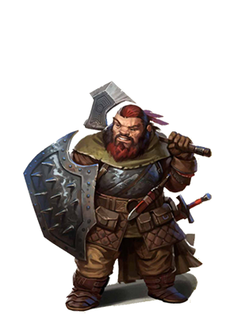
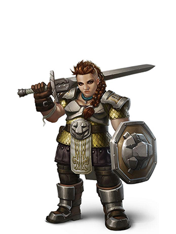

Будучи **горным дварфом**, вы являетесь сильным и выносливым, приспособленным к жизни в суровой местности. Вы довольно высоки (по дварфской мерке), и скорее светлокожи.

### Стартовые параметры
Характеристики
- Телосложение +2
- Сила +2

Размер: средний (рост от 122 до 152 см, вес около 70кг)
Скорость: 25 футов

Владения:
 - Боевой топор
 - Топор
 - Лёгкий молот
 - Боевой молот
 - *Лёгкие доспехи*
 - *Средние доспехи*
 - Одно владение инструментами на выбор: кузнечные, пивовара или каменщика.

Умения:
- **Ночное зрение** (до 60 футов)
- **Устойчивость к ядам** - спасброски против яда проходят с преимуществом, сопротивление к урону ядом
- **Знание камня** - при проверке Истории, связанной с работой по камню, персонаж считается владеющим навыком История и получает удвоенный бонус мастерства.

Языки: Общий, Дварфийский

