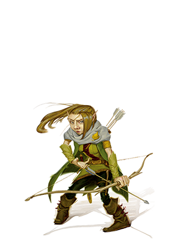

**Лесные гномы** обладают природными способностями к иллюзии, и унаследовали проворство и скрытность.

Характеристики
- Интеллект +2
- Ловкость +1

Размер: маленький  (рост от 91 до 122 см, вес около 18 кг)
Скорость: 25 футов

Бонусы:
- **Ночное зрение** (до 60 футов)
- **Гномья хитрость** - Вы совершаете с преимуществом спасброски Интеллекта, Мудрости и Харизмы против магии.
- Вы знаете заговор [Малая иллюзия](</Правила/Магия/Малая иллюзия.md>). Базовой характеристикой для его использования является Интеллект
- **Общение с маленькими зверями** - С помощью звуков и жестов вы можете передавать простые понятия Маленьким или ещё меньшим зверям.

Языки: Общий, Гномий

