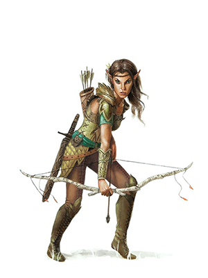

Поскольку вы — **лесной эльф**, у вас обострённые чувства и интуиция, и ваши стремительные ноги несут вас быстро и незаметно через ваши родные леса.

### Стартовые параметры
Характеристики
- Ловкость +2
- Мудрость +1

Размер: средний (рост от 152 до 183 см)
Скорость: 35 футов

Владения:
 - Длинный меч
 - Короткий меч
 - Длинный лук
 - Короткий лук

Бонусы:
- **Ночное зрение** (до 60 футов)
- Владеет навыком Внимательность
- **Наследие фей** - спасброски против очарования проходят с преимуществом, невозможно усыпить магически
- **Транс** - эльфы не спят, вместо этого они погружаются в медитацию на 4 часа в сутки
- **Маскировка в дикой местности** - можно попробовать спрятаться в листве, сильном дожде, снегопаде, тумане или другом природном явлении.

Языки: Общий, Эльфийский

