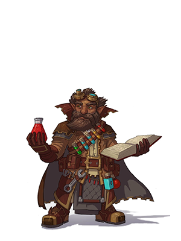
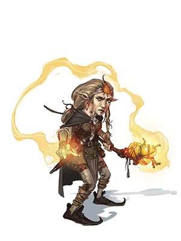

**Скальные гномы** выделяются своей изобретательностью и стойкостью.

### Стартовые параметры
Характеристики
- Интеллект +2
- Телосложение +1

Размер: маленький  (рост от 91 до 122 см, вес около 18 кг)
Скорость: 25 футов

Бонусы:
- **Ночное зрение** (до 60 футов)
- **Гномья хитрость** - Вы совершаете с преимуществом спасброски Интеллекта, Мудрости и Харизмы против магии.
- **Ремесленные знания** - При совершении проверки История применительно к магическому, алхимическому или технологическому объекту, вы можете добавить к проверке удвоенный бонус мастерства вместо обычного.
- **Жестянщик**  - Вы владеете ремесленными инструментами (инструменты жестянщика). За 1 час и материалы на 10 золотых можно собрать: заводную игрушку, зажигалку или музыкальную шкатулку.

Языки: Общий, Гномий

