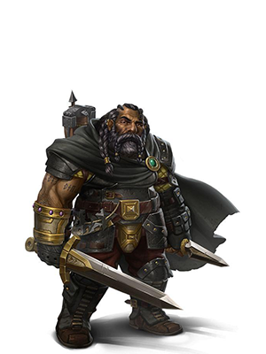
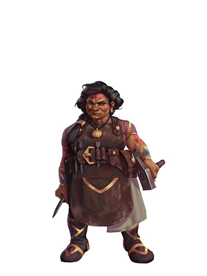

Будучи **холмовым дварфом** вы обладаете обострёнными чувствами, развитой интуицией и замечательной стойкостью.

Характеристики
- Телосложение +2
- Мудрость +1

Размер: средний (рост от 122 до 152 см, вес около 70кг)
Скорость: 25 футов

Владения:
 - Боевой топор
 - Топор
 - Лёгкий молот
 - Боевой молот

Бонусы:
- Ночное зрение (до 60 футов)
- Дварфийская устойчивость - спасброски против яда проходят с преимуществом, сопротивление к урону ядом
- Владение инструментами - одно на выбор: кузнечные, пивовара или каменщика.
- Знание камня - при проверке Истории, связанной с работой по камню, персонаж считается владеющим навыком История и получает удвоенный бонус мастерства.
- **Дварфийская выдержка** - здоровье +1 за каждый уровень персонажа.

Языки: Общий, Дварфийский

