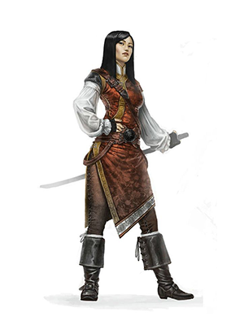

**Люди** являются самыми приспособленным и амбициозным народом среди распространённых рас. Их вкусы, нравы и обычаи сильно отличаются во множестве разных земель, где они поселились. Однако там, где они селятся, они остаются надолго.

Характеристики
- Все +1

Размер: средний (рост 152 - 183 см)
Скорость: 30 футов

Языки: Общий, один на выбор

